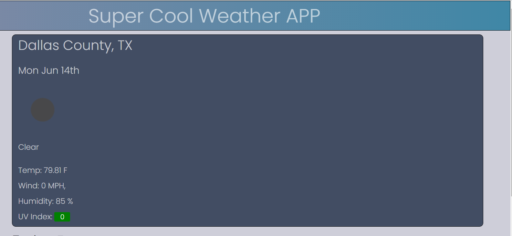
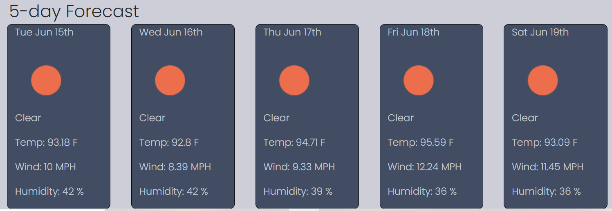
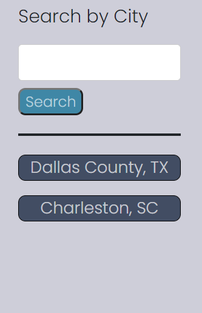

# Jacob's Weather
A front end application connecting to two API endpoints. Probably one of my favorite projects to develop. 


### **Description**

This is the first iteration of a weather tracking application, developed with vanilla Javascript (with a little help from Moment.js), and Bootstrap.

App URL: https://lelandcypress.github.io/Jacobs_Weather/


### Technology Used
1. Plain old JavaScript
2. HTML
3. CSS/Bootstrap
4. Open Weather API: https://openweathermap.org/api

### **User Experience**

1. Upon entering either a city, or a city/state (comma seperated), the user is presented with the current weather. Of note, I used some CSS to color code the UV Index based on severity.



2. The user is also presented with a five day forecast starting the day after the weather displayed in the main card.



3. Using Local Storage, we render the previous searches entries under the search input. If the user clicks on any of the previous searches, it will display the information in the main card and five day forecast section.



### **Developer Notes**

This application makes use of two endpoints of the OpenWeather API. The first endpoint will convert the user entry to latitude and longitude information that can be used to search the OpenWeather OneCall API.

If you are using this API just be aware that instead of returning 404 codes in the case of bad user input, the API will redirect you to a defaulted city or only return an empty array. So if your users are being directed to Bay Minette Alabama, you are getting the default US Search Value, and most likely this is because they are not passing in any values in the search input

The same holds true at the same level, so if users are getting the same town per state, they are getting the default value, most likely by passing in the two digit state code only. To counter this I wrote an if statement to evaluate whether the input field is blank. This does not guard against mispelled or non existent towns

```
//Open Weather will pull a default US city instead of returning a 404 error. This prevents user from accessing weather of default city//
if (userCity === "") {
displayFailure.textContent = "Please enter a valid City and State";
return;
} else {
displayFailure.textContent = "";
getLocation(userCity);

    renderPreviousSearch();
    citySearch.value = "";

}
});
```

Icons were genereated by OpenWeather API, who will provide you with the starter URL, and an Icon code.

```
var currentIcon = data.current.weather[0].icon;
//Icons//
mainIcon.setAttribute(
"src",
"https://openweathermap.org/img/wn/" + currentIcon + "@2x.png"
);
```

Badges provided by [Shields.io](https://shields.io/)

## Contact
If you have any questions about this project, you can reach out at [lelandcypress](https://github.com/lelandcypress), or souterm1@gmail.com
